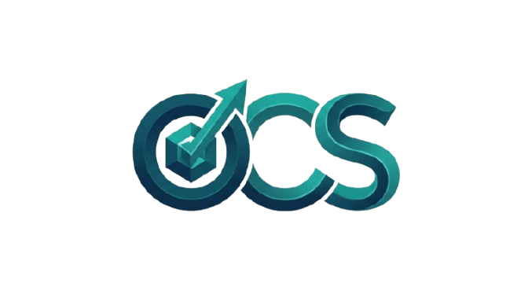

<div align="center">
  <a href="https://optivisconsultancyservices.tech" target="_blank" rel="noopener noreferrer">
    
  </a>

  # ⚡ Optivis Consultancy Services

  ### **Enterprise Digital Transformation • AI Workloads • Cloud Architecture • Full-Stack Web & Mobile Engineering**

  [](https://optivisconsultancyservices.tech)
  [](https://nextjs.org/)
  [](https://www.typescriptlang.org/)
  [](https://tailwindcss.com/)
  [](https://opensource.org/licenses/MIT)

</div>

---

## 📌 Overview

**Optivis Consultancy Services** is an enterprise-grade digital transformation web platform. Built with **Next.js 16 (App Router + Turbopack)**, **React 19**, **TypeScript**, and **Tailwind CSS 4**, this repository powers Optivis' global online presence—delivering lightning-fast performance, rich glassmorphism aesthetics, interactive consultation booking, automated audit workflows, and deep SEO optimization.

Headquartered in **Bhubaneswar, Odisha, India**, Optivis serves enterprise clients globally across India, the United States, United Kingdom, UAE, and Singapore.

---

## ✨ Features & Highlights

### 🎨 **Modern Design & User Experience**
- **Sleek Dark Mode Aesthetics**: Dynamic glassmorphism panels, vibrant gradient accents, and curated HSL color schemes.
- **Custom Interactive Cursor**: Smooth physics-based custom tracking cursor with hover & text input detection (hydration-safe).
- **Framer Motion Micro-Animations**: Smooth scroll reveal animations, modal transitions, and interactive UI component states.
- **Full Responsiveness**: Mobile-first architecture tested across all screen dimensions.

### 📅 **Enterprise Consultation Booking Engine**
- **Interactive Booking Modal**: Real-time service selection, budget range estimation, date/time scheduling, and timezone formatting.
- **Instant Email Dispatch**: Submits lead data directly via **Web3Forms API** with structured email summaries delivered to the team inbox.

### 📩 **Contact & Free Technical Audit Forms**
- **Connected API Route (`/api/contact`)**: Server-side validation and email submission endpoint.
- **Free 48-Hour Technical Audit Banner**: Instant website/app URL evaluation request workflow.
- **Robust Error Handling**: Real-time form validation with clear user feedback and confirmation states.

### 🚀 **Comprehensive SEO & Structured Data (JSON-LD)**
- **Dynamic Meta Tags**: Automated OpenGraph, Twitter Cards, Canonical URLs, and Robots configuration.
- **JSON-LD Schema Integration**: Full support for `Organization`, `LocalBusiness`, `WebSite`, `FAQPage`, `BreadcrumbList`, and `Person` schemas.
- **High Performance**: Optimized Next.js static page generation and `.webp` image assets.

### 🛠️ **Developer Experience & Tooling**
- **Turbopack Compiler**: Lightning-fast local development HMR and production builds.
- **Containerized**: Production-grade `Dockerfile` included for cloud deployments (Vercel, AWS, Docker).
- **Python Integration**: Pre-configured Python virtual environment (`venv`) for data scripts or auxiliary tools.
- **CI/CD Integration**: GitHub Actions configuration for automated linting and build validation.

---

## 🛠️ Tech Stack

| Category | Technology |
|---|---|
| **Core Framework** | [Next.js 16 (App Router)](https://nextjs.org/) + [Turbopack](https://nextjs.org/docs/app/api-reference/turbopack) |
| **Language** | [TypeScript 5](https://www.typescriptlang.org/) / React 19 |
| **Styling** | [Tailwind CSS 4](https://tailwindcss.com/) / Vanilla CSS Tokens |
| **Animations** | [Framer Motion](https://www.framer.com/motion/) / Lucide Icons |
| **Form & Email Delivery** | [Web3Forms API](https://web3forms.com/) / Next.js Server API Routes |
| **Utility & Tooling** | ESLint / PostCSS / Python 3.11 (`venv`) |
| **Deployment** | Docker / GitHub Pages (`.nojekyll`) / Vercel |

---

## 🚀 Getting Started

### Prerequisites
- **Node.js**: `>= 20.0.0`
- **npm**: `>= 10.0.0`

### 1. Clone the Repository
```bash
git clone https://github.com/satyazitmohapatra/optiviswebsiterepo.git
cd optiviswebsiterepo
```

### 2. Install Dependencies
```bash
npm install
```

### 3. Run Development Server
```bash
npm run dev
```
Open [http://localhost:3000](http://localhost:3000) in your browser to view the application.

### 4. Production Build & Start
```bash
# Compile optimized production build
npm run build

# Start production server
npm run start
```

---

## 🐳 Docker Deployment

Build and run using Docker:

```bash
# Build Docker image
docker build -t optivis-webapp .

# Run Docker container
docker run -p 3000:3000 optivis-webapp
```

---

## 📂 Project Structure

```text
optiviswebsiterepo/
├── public/                     # Static assets (WebP team portraits, logos, icons)
│   ├── images/                 # Optimized WebP & PNG visual assets
│   └── .nojekyll               # Disables Jekyll processing on GitHub Pages
├── src/
│   ├── app/                    # Next.js App Router
│   │   ├── api/contact/        # Contact & Audit submission API route
│   │   ├── globals.css         # Custom design system tokens & styles
│   │   ├── layout.tsx          # Root Layout (Providers, Navbar, Footer, CustomCursor)
│   │   └── page.tsx            # Main Landing Page assembly
│   ├── components/
│   │   ├── layout/             # Navbar, Footer, Container, SmoothScroll
│   │   ├── sections/           # Hero, Services, About, Pricing, Team, Contact, Audit
│   │   └── ui/                 # BookingModal, CustomCursor, Cards, Badges
│   ├── data/                   # Dynamic site content (team members, services, stats)
│   └── lib/                    # Booking API engine, SEO utils, Schema generators
├── .nojekyll                   # Root GitHub Pages configuration
├── Dockerfile                  # Production container configuration
├── next.config.ts              # Next.js configuration
├── tailwind.config.ts          # Tailwind styling options
└── package.json                # Project dependencies & scripts
```

---

## ⚙️ Environment Variables (Optional)

You can customize form delivery and site URLs using `.env.local`:

```env
# Web3Forms Key (Get your key from https://web3forms.com)
NEXT_PUBLIC_WEB3FORMS_ACCESS_KEY="your_web3forms_access_key_here"
WEB3FORMS_ACCESS_KEY="your_web3forms_access_key_here"

# Canonical Site URL
NEXT_PUBLIC_SITE_URL="https://optivisconsultancyservices.tech"
```

---

## 🔗 Connect With Us

- **Official Website**: [optivisconsultancyservices.tech](https://optivisconsultancyservices.tech)
- **LinkedIn**: [Optivis Consultancy Services](https://www.linkedin.com/company/optivisconsultancy)
- **Instagram**: [@optivisconsultancy](https://instagram.com/optivisconsultancy)
- **Support Email**: [optivis.ocs.support@gmail.com](mailto:optivis.ocs.support@gmail.com)
- **Phone**: +91 79782 89942

---

## 📄 License

This project is licensed under the [MIT License](LICENSE).

<div align="center">
  <sub>Developed with ❤️ by <strong>Optivis Consultancy Services</strong></sub>
</div>
